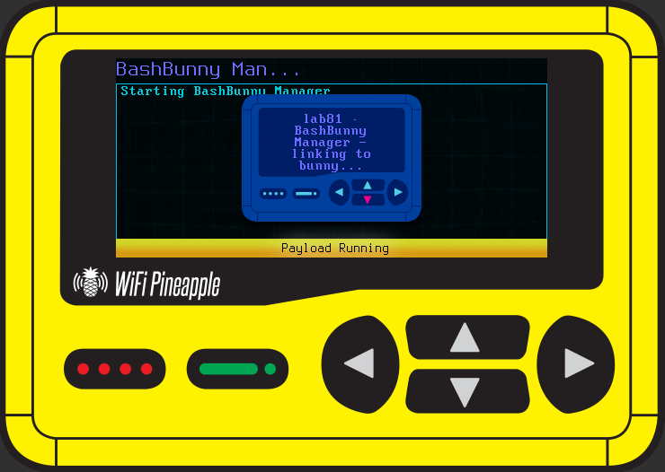
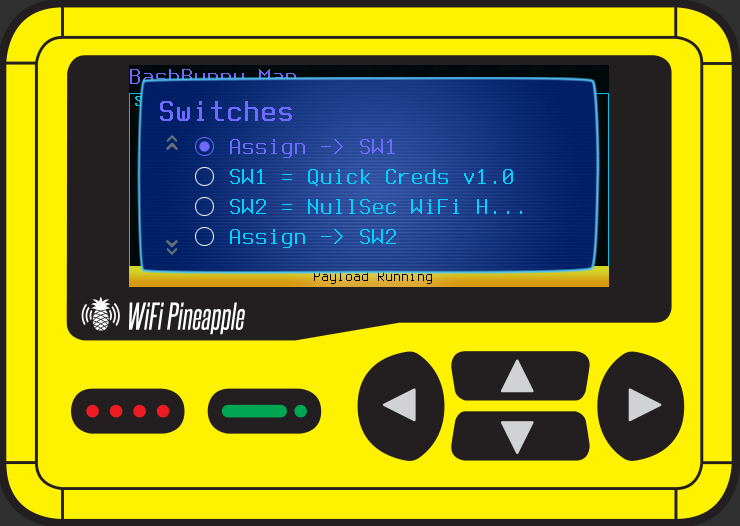
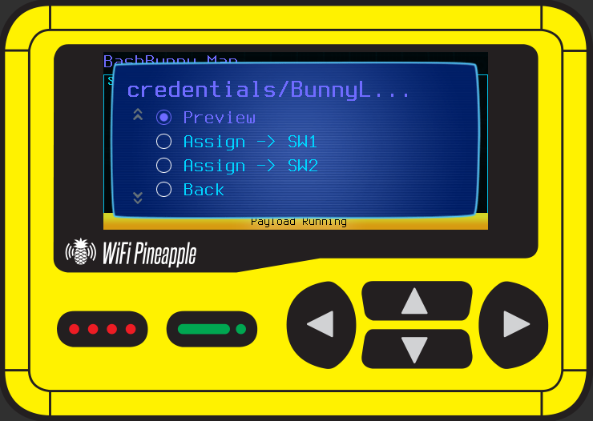

# BashBunny Manager

**BashBunny Manager** turns the WiFi Pineapple Pager into a field control panel for a
docked Hak5 **BashBunny**. Dock a BashBunny in **arming mode** (switch position 3) and manage
its payloads and loot entirely from the Pager's screen — assign which payload sits on switch 1
and switch 2, browse and upload your library, pull loot back to the Pager, back up and restore
your switch config, and fill in any settings a payload still needs.

- **Author:** lab81 <hello@lab81.io>
- **Version:** 1.0

## Screenshots

The Lab81 loading screen while it links to the docked bunny:

The main menu (titled with the active backend):

The **Switches** screen shows the current assignment inline (`SW1 = … / SW2 = …`) — tap a switch to preview it:

Browse the library and assign a payload straight to a switch:

## Scope

Administration of **your own** BashBunny. This payload does not attack, target, or exfiltrate
from any third party — it only manages the docked device's own filesystem (payloads and loot).

## Requirements

- A Hak5 **BashBunny**, set to **arming mode** (switch position 3, closest to USB), docked to the
  Pager's USB-A (host) port.
- **No extra software for the primary path.** The mass-storage backend is pure POSIX shell.
- **Optional:** the serial-console fallback backend uses `python3` at `/mmc/usr/bin/python3`. It is
  only used when the udisk can't be mounted directly (see *microSD note*). LED / ringtone / vibrate
  feedback is used when available and silently skipped otherwise.

## How it works (two backends, auto-selected)

In arming mode the BashBunny presents **both** its udisk as USB mass storage **and** a serial
console. On launch the payload picks the best transport automatically:

1. **Mass storage (default, fastest):** the Pager mounts the bunny's udisk and manages payloads/loot
   as plain files. Shown as `[msd]` in the menu title.
2. **Serial console (fallback):** if the udisk can't be mounted, it logs into the bunny's arming
   console and does the same operations over the wire. Shown as `[console]`.

> **microSD note:** with a microSD inserted, arming mode exports the **microSD** as the mass-storage
> LUN instead of the payload udisk, so the payload falls back to the console backend automatically.
> For the fast mass-storage path, remove the microSD and re-arm.

## Usage

Arm the BashBunny (switch pos 3) and dock it, then run **Payloads → BashBunny Manager**. You'll see
a short loading screen while it links, then the main menu (titled with the active backend):

- **Switches** — the current assignment is shown inline (`SW1 = QuickCreds v2` / `SW2 = …`); tap a
  switch to preview it. Assign a library payload to SW1/SW2, swap them, or clear one. On a successful
  assign you get LED + ringtone confirmation, and if the chosen payload has unset settings you're
  prompted to fill them in (see *Configuration*).
- **Loot** — list the bunny's loot, download all or one file to the Pager's
  `loot/FromBashBunny/`, or empty the loot folder. Downloads show a summary popup when done.
- **Upload payload** — stage payloads on the Pager in `BashBunny_Payloads/` (laid out as
  `<category>/<Name>/`) and upload them into the bunny's library, individually or as a whole-folder sync.
- **Library** — browse payloads (filter by category or show all), delete a library payload, or run a
  readiness check that verifies a switch's dependencies (e.g. `/tools/…`) exist on the bunny.
- **Backup / Restore** — snapshot switch 1 + switch 2 (and a manifest) to the Pager, and restore later.
- **Status** — device/backend/udisk info, shown in a dismissable dialog.
- **Safe-eject & Exit** — flush writes and unmount so you can undock cleanly. Re-arm the bunny to use it.

## Configuration

Many BashBunny payloads have settings the operator must fill in (SSIDs, targets, etc.). After you
assign a payload to a switch, BashBunny Manager scans it for **placeholder** settings — top-of-file
`KEY=value` lines whose value is empty or a placeholder (`CHANGEME`, `<ip>`, `YOUR_…`, `REPLACE`, …) —
and offers to set each one on-screen, writing your values into that switch's `payload.txt`. Payloads
you stage for upload should use placeholders (never your personal URLs / keys / passphrases).

## Pager paths (auto-created on first run)

- Loot downloads: `<base>/loot/FromBashBunny/`
- Upload staging: `<base>/BashBunny_Payloads/` (organized `<category>/<Name>/`)
- Backups: `<base>/BashBunny_Backups/<timestamp>/`

`<base>` resolves to the Pager's persistent storage (`/mmc/root`, else `/root`).

## Files

- `payload.sh` — the interactive menu (UI only).
- `bb.sh` — transport-agnostic backend: mass-storage implementation + backend auto-selection/routing.
- `bunnyarm.py` — the serial-console fallback backend.
