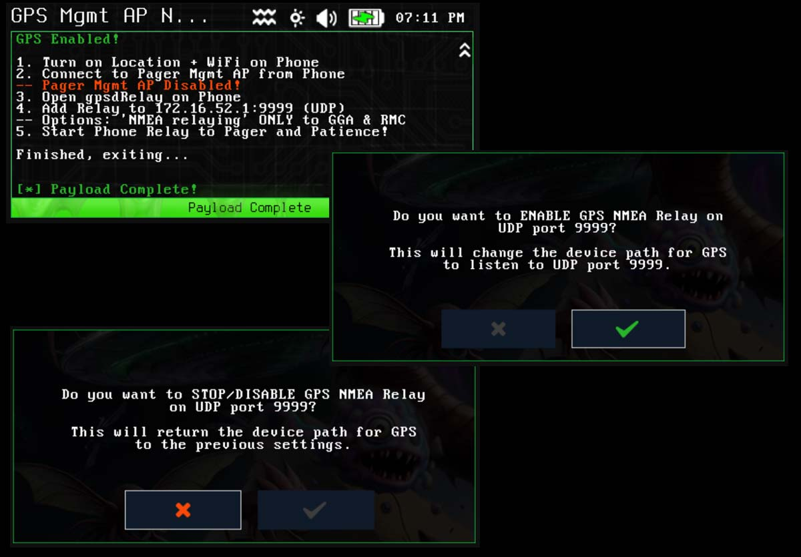
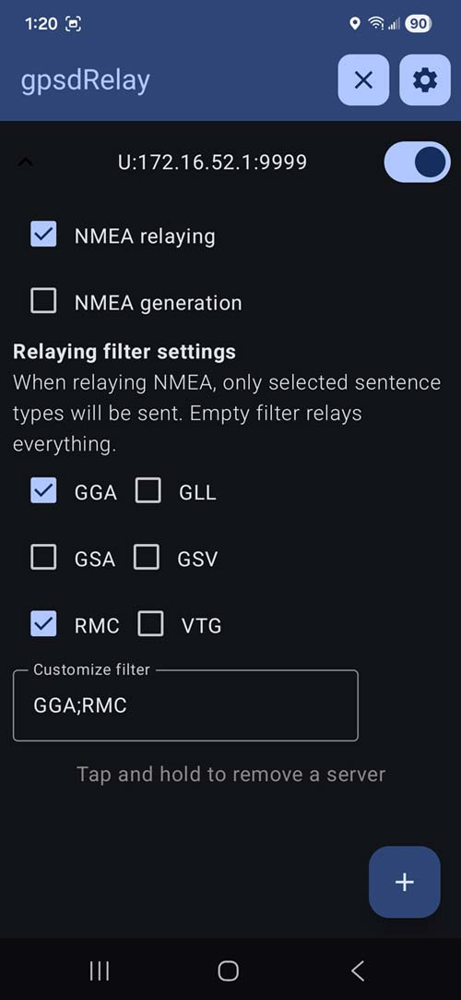
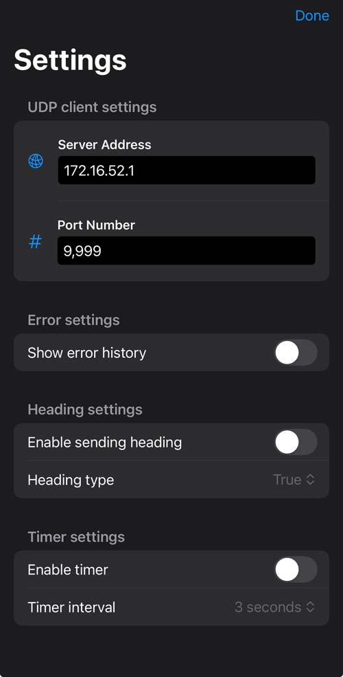

# GPS Mgmt AP NMEA UDP Port 9999 (gps-mgmtap-nmea)

Turn your phone into your GPS for the Pager with minimal effort!  Allows stop/start of UDP Port 9999 NMEA GPS data collection for the Pager.  Can use Android app gpsdRelay, iPhone NMEA Send Location App, C5 Wardriver, or similar GPS relaying apps/devices to relay NMEA information to the gpsd server UDP Port 9999 on the Pagers Management AP.  This allows NMEA information to be passed to the device from any NMEA source on the Pagers Mgmt AP sending UDP NMEA data to UDP Port 9999.  It can take some time until data starts being received, and that relies on the phone/sending devices GPS signal.

# gpsdRelay Android app settings

# NMEA Send Location iPhone app settings

