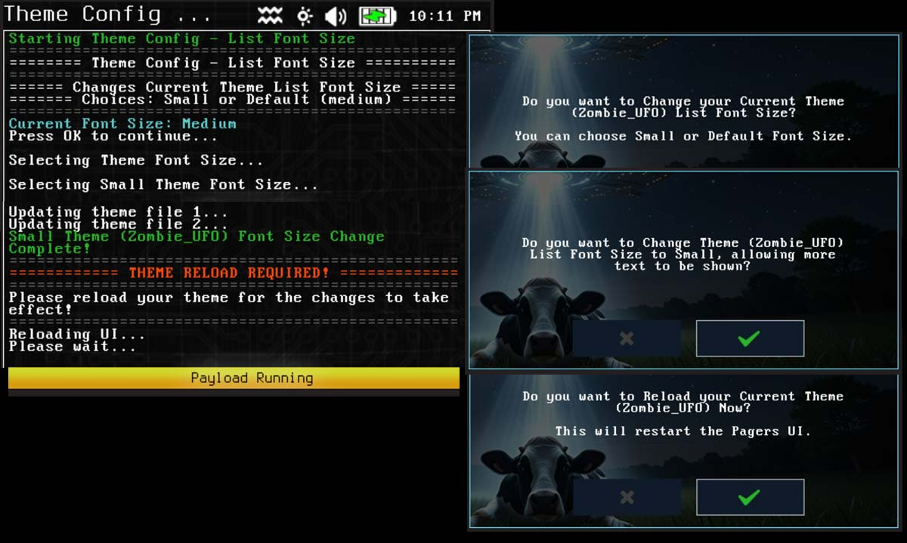

# Theme Config - List Font Size (theme-cfg-list-font)

Changes files relating to the list picker font size to be smaller, can return back to default.  Theme needs to be reloaded after changing to apply.

Comparing font sizes for list picker:
