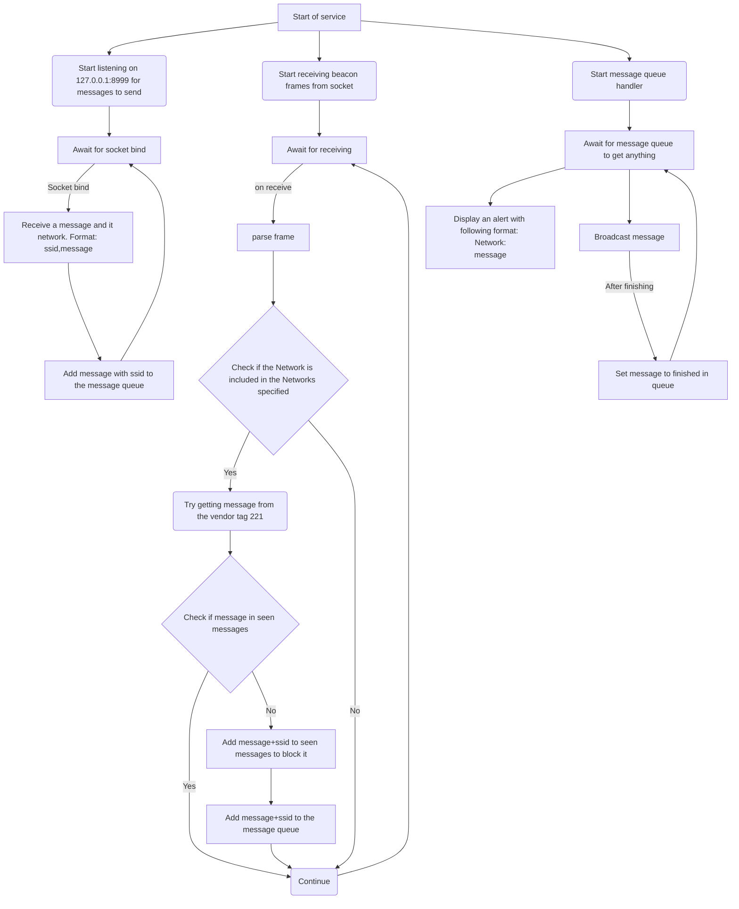

# P2P Pager

## Description

P2P Pager is an implementation of an idea Darren had whilst streaming.

It's a pager system for the WiFi Pineapple Pager which uses Access Points to send messages to other pagers in the same "network", a so to say pager to pager system. And repeating the messages to have a bigger range.

> [!IMPORTANT]  
> This is an early access project, it's still in development and may contain bugs. Let me know if you find any issues or have any suggestions for improvements.

## Author

ERR0RW0LF

## Credits

- Darren Kitchen - Original idea and inspiration.

## Getting Started

To get started with the P2P Pager, follow these steps:

1. Get the payloads from the repository and the other files in the folders.
2. Install the service using the `P2P - Manage Service` payload.
3. Configure the networks you want to listen to and send messages to using the `P2P - Manage Networks` payload.
4. (Optional) Configure the service settings using the `P2P - Manage Configuration` payload.
5. Send messages using the `P2P - Send Message` payload.

> [!NOTE]
> The service will be automatically enabled when installing it you can disable it using the `P2P - Manage Service` payload.
 
## Known Issues

- Messages are not encrypted
- No authentication mechanism, anyone can send messages to the pagers in range.
- around 50 percent chance of messages being not received (still working out the reason for this)
- currently only supports the wifi pineapple pager, but shouldn't be hard to adapt it to other systems like raspberry pi zero w or similar devices with wifi capabilities

## Files

### Payloads

| Payload                | Name                       | Description                                                                            |
| ---------------------- | -------------------------- | -------------------------------------------------------------------------------------- |
| p2p_pager              | P2P - Manage Service       | Install and manage the P2P Pager service.                                              |
| p2p_pager_networks     | P2P - Manage Networks      | Configure the networks that the P2P Pager will listen to and rebroadcast messages for. |
| p2p_pager_config       | P2P - Manage Configuration | Configure the P2P Pager service.                                                       |
| p2p_pager_send_message | P2P - Send Message         | Send a message to other P2P pagers in range.                                           |

### Internal files

| File Name         | Description                                                                      |
| ----------------- | -------------------------------------------------------------------------------- |
| pager.conf        | Main configuration file for the P2P Pager service.                               |
| networks.conf     | List of networks that the P2P Pager will listen to and rebroadcast messages for. |
| p2p_pager.py      | Main script for the P2P Pager service.                                           |
| p2p_pager_send.py | Script to send messages to other P2P pagers.                                     |

## Where everything is stored

Config files:
- `/root/.p2p_pager/pager.conf` - Main configuration file for the P2P Pager service.
- `/root/.p2p_pager/networks.conf` - List of networks that the P2P Pager will listen to and rebroadcast messages for.

Installation:
- `/etc/init.d/p2p_pager` - Init script for the P2P Pager service.
- `/usr/bin/start_p2p_pager.sh` - Script to start the P2P Pager service.
- `/usr/bin/p2p_pager` - Main script for the P2P Pager service.
- `/usr/bin/p2p_pager_send.py` - Script to send messages to other P2P pagers.

Development files:
> [!NOTE]  
> These files are not required for the service to run, but I keep them here for development purposes and as examples of how to send and receive beacon frames.
- `send_beacon.py` - Simple demo script to send beacon frames.
- `receive_beacon.py` - Simple demo script to receive beacon frames.

## How it works

The P2P Pager works by creating a beacon frame with the message embedded in an IE (Information Element), with the tag 221 (Vendor Specific). Other pagers in range will pick up the beacon frames, extract the message, and rebroadcast it to extend the range.

To avoid message flooding, each pager keeps track of the messages it has already seen and will not rebroadcast the same message more than once.

