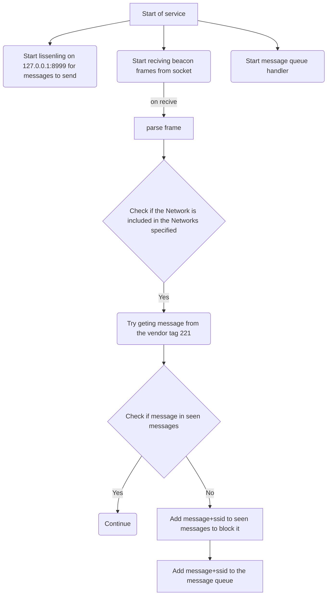

# P2P Pager

## Description

P2P Pager is an implementation of an idea Darren had whilst streaming.

It's a pager system for the WiFi Pineapple Pager which uses Access Points to send messages to other pagers in the same "network", a so to say pager to pager system. And repeating the messages to have a bigger range.

## Author

ERR0RW0LF

## Credits

- Darren Kitchen - Original idea and inspiration.
- PentestPlaybook - For the inspiration of the structure of the payloads and documentation.

## Payloads

| Payload | Description |
| ------- | ----------- |
|p2p_pager_send_message | Send a message to other P2P pagers in range. |
|psp_pager | Install and manage the P2P Pager service. |

## How it works

The P2P Pager works by creating a beacon frame with the message embedded in an IE (Information Element), with the tag 221 (Vendor Specific). Other pagers in range will pick up the beacon frames, extract the message, and rebroadcast it to extend the range.

To avoid message flooding, each pager keeps track of the messages it has already seen and will not rebroadcast the same message more than once.

