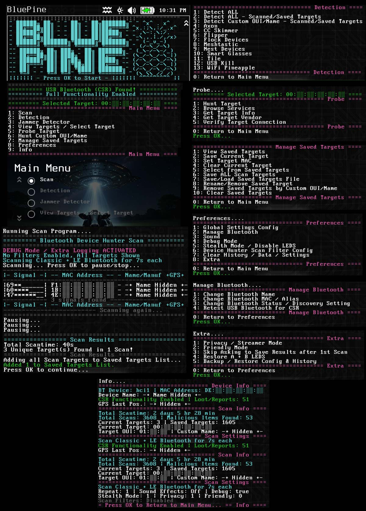
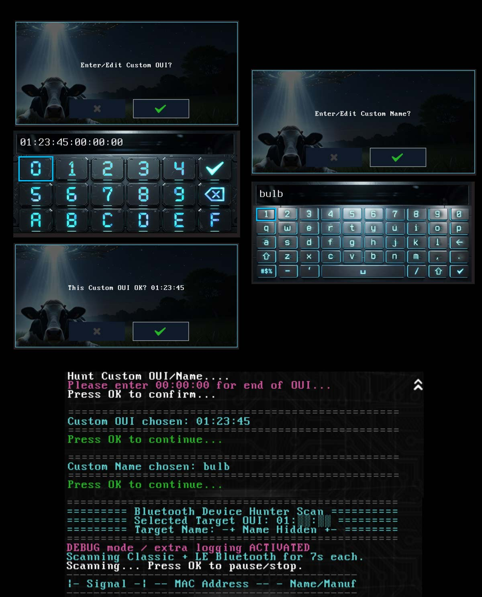
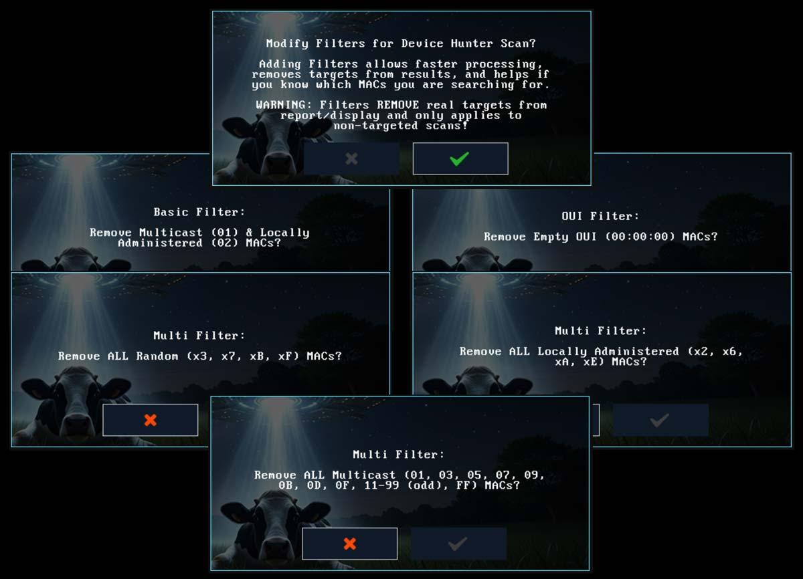
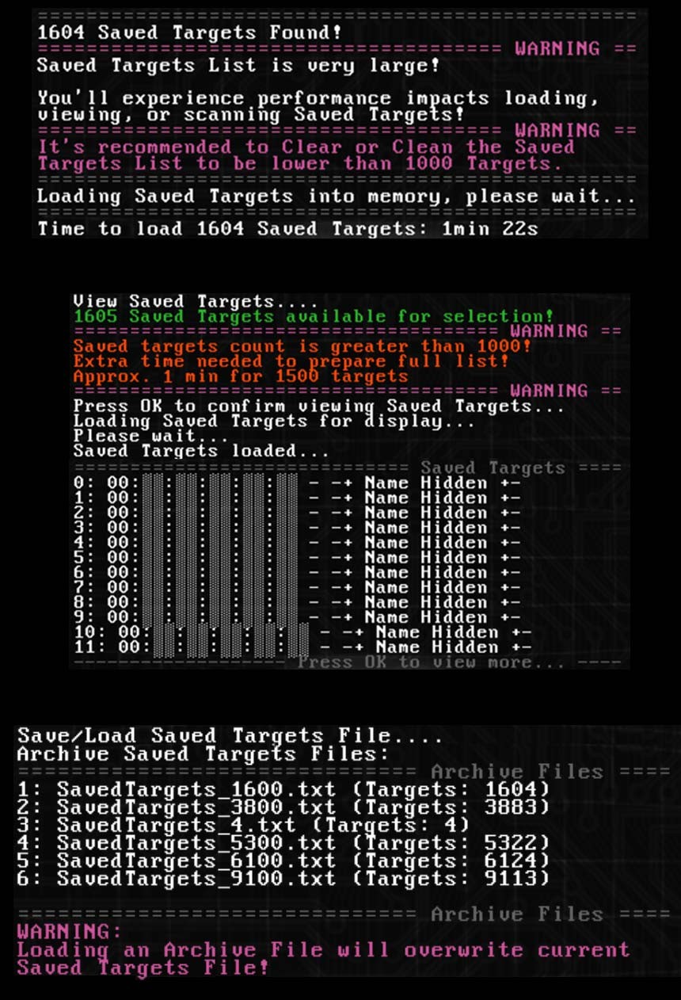
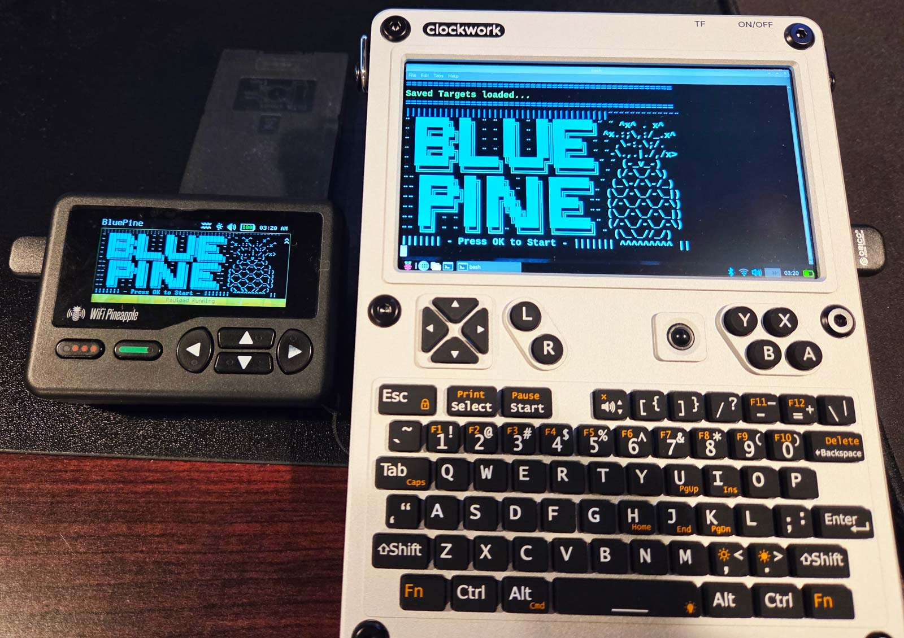

# BluePine (bt-bluepine)
Bluetooth Device Detection & Hunting Suite. Detection Scanner, Jammer Locator, Target Probing, Last Target and Saved Targets List Management, Save / Load Saved Target List from File, Configuration Saving, GPS, Debugging, Privacy, Stealth, and more.  Full functionality tested on Pagers internal Bluetooth & USB CSR8510 / CSR v4.0 Bluetooth Adapter.  Without a USB CSR v4.0 Bluetooth Adapter there will be a slightly limited experience due to less signal/range, no jammer location capabilities, and inability to change the built in MAC.

To install/run, copy the "bt-bluepine" folder with "include" subfolder to the folder of your choice on the pager in "/mmc/root/payloads/user/" and run "BluePine".

Ex. "/mmc/root/payloads/user/reconnaissance/bt-bluepine" would put "BluePine" under the "Reconnaissance" menu.

On first run it will run through an automated install for dependency "evtest" which monitors the pagers input buttons for pausing/stopping infinite scans, and "GNU grep" for more efficient pattern matching.  After dependencies are checked/installed, ringtones will be verified and copied if they do not exist.  When dependencies and ringtones are met, you will reach the BluePine menu and these items will be checked silently each start of the app without being prompted again.  It's tested on Pager Firmware 1.0.8+ and should work on all future versions. 

Each time the app starts it will check for external Bluetooth and if found, it will ask about a USB Bluetooth Adapter to select which Bluetooth interface to use for scanning.  Using a USB CSR8510 / CSR v4.0 Bluetooth Adapter instead of the internal Bluetooth provides better range and ability to change MAC address.

MAC details and device names are hidden in the images below due to "Privacy Mode" being enabled. Privacy Mode allows you to hide major details on the pager screen/display while keeping full functionality.  Privacy mode is disabled by default and can be enabled in Preferences -> Extra.

# Menus/Scanning

# Custom OUI/Name Search

# Prompts/Configuration

# MAC Filtering

# Saved Target Loading + Save/Load File

# Changing List Picker Font Size
The default font size for the list picker is set at medium as seen below (on the right):

BluePines menus look best if the list picker font size is small.  [Please use this tool](https://github.com/cncartistsec/WiFi-Pineapple-Pager-Payloads/tree/main/theme-cfg-list-font) which changes files relating to the list picker font size to be smaller, can return back to default.  Theme needs to be reloaded after changing to apply.

# Multi-Architecture Support

AArch64/ARM64/Debian Support files are not included with the pager payload from the Hak5 repo.  BluePine is tested on ClockworkPi (Trixie) & Hackberry (Kali) and should work on other Raspberry Pi based systems.  The files can be found [here along with the latest version of BluePine](https://github.com/cncartistsec/BluePine-WiFi-Pineapple-Pager/).

Required files for AArch64/ARM64/Debian Support are in the "include/aarch64" folder, desktop shortcut/icon included.  There are different dependencies for AArch64/ARM64/Debian which are built into the scripts dependency check: "jq" & "ieee-data" (oui info) are required, while "evtest" is not.
