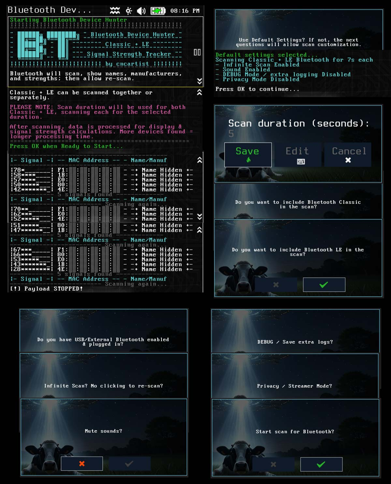

# Bluetooth Device Hunter (bt-device-hunter)

Bluetooth Device Hunter (Classic + LE combined or separate).  Data builds over time in case name or manufacturer is missed on first scans.  Custom configuration allowed.  Verbose logging / debugging / mute / privacy mode available.  Includes GPS coordinate logging if GPS device enabled.

The [BluePine Bluetooth Scanning Suite](https://github.com/cncartistsec/BluePine-WiFi-Pineapple-Pager) includes all of the Bluetooth Scanners + Tools in one payload and will receive more frequent updates.